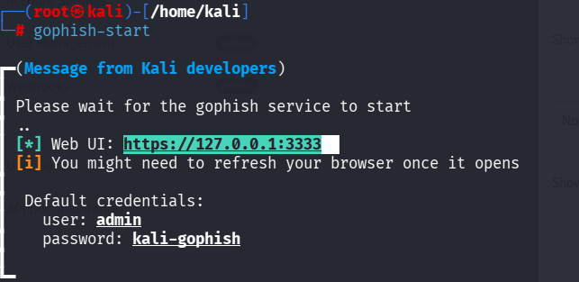
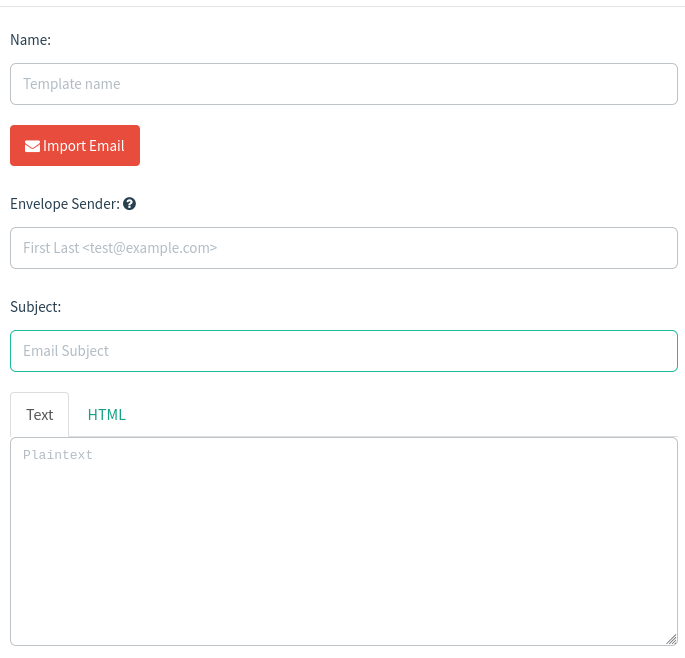

# 🎣 Gophish Setup and Email Template Creation (Kali Linux)

> **Disclaimer:** This project is intended **only for authorized security awareness training, phishing simulations, and penetration testing**. Never use Gophish against systems or users without explicit permission. Humans already click enough suspicious links on their own. They don't need extra encouragement.

---

# 📌 What is Gophish?

Gophish is an open-source phishing framework designed for:

- Security Awareness Training
- Red Team Assessments
- Internal Phishing Simulations
- Email Campaign Testing

It provides a simple web interface for creating email templates, landing pages, and phishing campaigns.

---

# Requirements

- Kali Linux
- Internet Connection
- Administrator (root) privileges

---

# Step 1: Install Gophish

Update your package list first.

```bash
sudo apt update
```

Install Gophish.

```bash
sudo apt install gophish
```

Verify installation.

```bash
gophish --help
```

If Gophish is already installed you'll see something similar to:

```
gophish is already the newest version.
```

---

## Installation Verification



---

# Step 2: Start Gophish

Launch the service using:

```bash
gophish-start
```

After a few seconds you'll see output similar to:

```
Please wait for the gophish service to start

Web UI:
https://127.0.0.1:3333

Default Credentials

Username: admin
Password: kali-gophish
```

Open your browser and visit:

```
https://127.0.0.1:3333
```

Accept the self-signed SSL certificate if prompted.

---

## Starting Gophish


---

# Step 3: Login

Default credentials:

| Username | Password |
|----------|----------|
| admin | kali-gophish |

After logging in you will reach the Gophish Dashboard.

---

# Creating an Email Template

Email templates define the message that will be sent during a phishing simulation.

Navigate to:

```
Email Templates
```

Click:

```
New Template
```

You'll see fields similar to:

- Name
- Envelope Sender
- Subject
- Text
- HTML

---

## Email Template Screen



---

# Understanding Each Field

## Name

A friendly name used only inside Gophish.

Example:

```
Microsoft Login Alert
```

---

## Envelope Sender

The sender shown during email delivery.

Example:

```
IT Support <support@example.com>
```

---

## Subject

Email subject.

Example:

```
Password Expiring Today
```

---

## HTML

This is where you design the phishing email using HTML.

Example:

```html
<h2>Password Expiration Notice</h2>

<p>Your password expires today.</p>

<p>
Click the link below to update your password.
</p>

<a href="{{.URL}}">
Reset Password
</a>
```

### Important Placeholder

```
{{.URL}}
```

This placeholder automatically inserts the unique phishing link for every recipient.

Without this placeholder, recipients won't receive their unique tracking URL.

---

## Plain Text

Optional text version for email clients that don't support HTML.

Example:

```
Your password expires today.

Please visit:

{{.URL}}
```

---

# Save the Template

Click

```
Save Template
```

Your template is now available for future phishing campaigns.

---

# Project Structure

```
Gophish-Lab/
│
├── README.md
│
└── images/
    ├── install.png
    ├── start.png
    └── template.png
```

---

# Common Commands

Install

```bash
sudo apt install gophish
```

Start

```bash
gophish-start
```

Default URL

```
https://127.0.0.1:3333
```

Default Username

```
admin
```

Default Password

```
kali-gophish
```

---

# Troubleshooting

## Gophish won't start

Check if another service is already using port **3333**.

```bash
sudo ss -tulpn | grep 3333
```

---

## Browser displays a security warning

This is expected because Gophish uses a self-signed certificate by default.

Proceed to the site after verifying you're accessing your local instance.

---

## Forgot credentials

Restart the service or check your Gophish configuration files if you've changed the default password.

---

# Learning Outcomes

By completing this lab you will learn:

- Install Gophish on Kali Linux
- Start the Gophish service
- Access the Web UI
- Login using default credentials
- Create an Email Template
- Use HTML templates
- Insert dynamic phishing links using `{{.URL}}`

---

# Disclaimer

This repository is created for **educational purposes**, **security awareness**, and **authorized penetration testing** only. Always obtain written permission before conducting phishing simulations or security assessments against any organization or individual.
